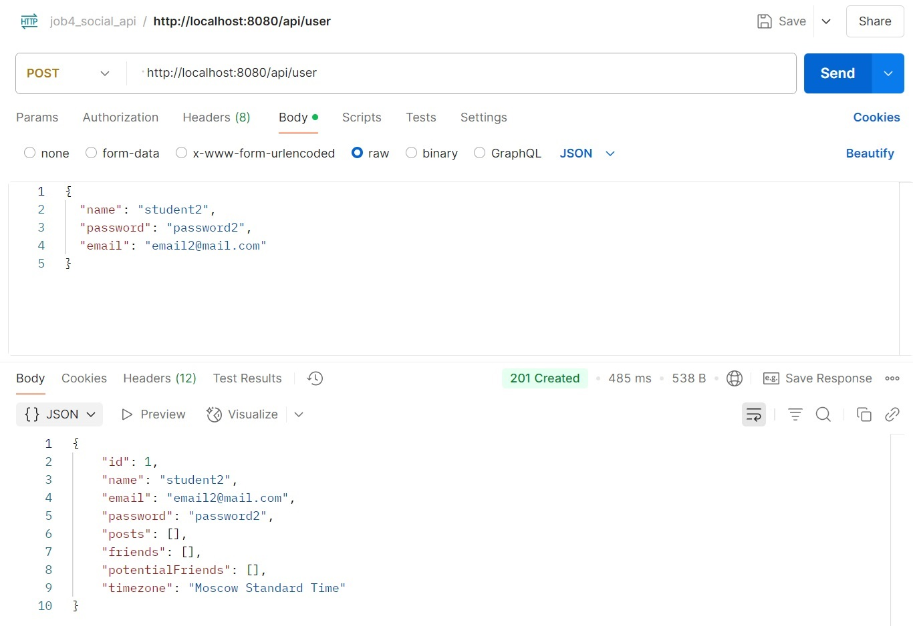
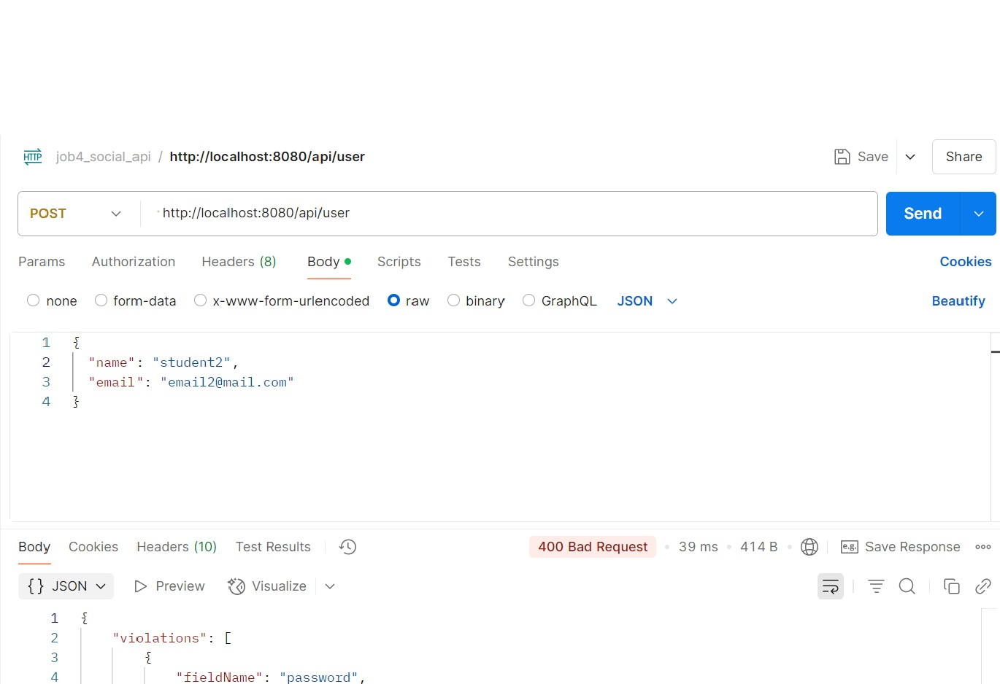
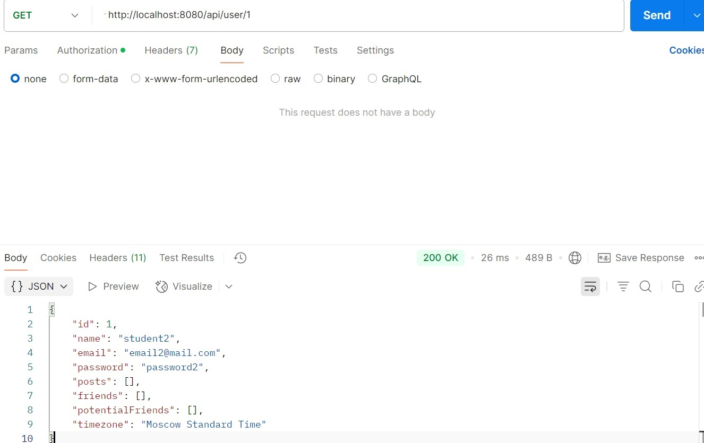

# job4j_social_media_api

### О проекте

"Форум" - веб-приложение, предоставляющее RESTful API для социальной медиа платформы, позволяющей
пользователям:

- регистрироваться;
- входить в систему;
- создавать посты;
- переписываться;
- подписываться на других пользователей;
- получать свою ленту активности.

### Описание

1. Аутентификация и авторизация

- Пользователи могут зарегистрироваться, указав имя пользователя, электронную почту и пароль.
- Пользователи могут войти в систему, предоставив правильные учетные данные.
- API должен обеспечивать защиту конфиденциальности пользовательских данных, включая хэширование паролей и использование
  JWT.

2. Управление постами

- Пользователи могут создавать новые посты, указывая текст, заголовок и прикрепляя изображения.
- Пользователи могут просматривать посты других пользователей.
- Пользователи могут обновлять и удалять свои собственные посты.

3. Взаимодействие пользователей:

- Пользователи могут отправлять заявки в друзья другим пользователям. С этого момента, пользователь, отправивший заявку,
  остается подписчиком до тех пор, пока сам не откажется от подписки. Если пользователь, получивший заявку, принимает
  ее, оба пользователя становятся друзьями. Если отклонит, то пользователь, отправивший заявку, как и указано ранее, все
  равно остается подписчиком.
- Пользователи, являющиеся друзьями, также являются подписчиками друг на друга.
- Если один из друзей удаляет другого из друзей, то он также отписывается. Второй пользователь при этом должен остаться
  подписчиком.
- Друзья могут писать друг другу сообщения (реализация чата не нужна, пользователи могу запросить переписку с помощью
  запрос а)

4. Подписки и лента активности:

- Лента активности пользователя отображает последние посты от пользователей, на которых он подписан.
- Лента активности поддерживает пагинацию и сортировку по времени создания постов.

### Технологии и инструменты

Java 17, Spring Boot 3, Liquibase 4, PostgreSQL, MapStruct 1.5.5.Final,
Spring Security, Swagger

### Требования к окружению

Java 17, Maven 3.4.0, PostgreSQL

### Запуск проекта

``` create database cinema;  ```
``` mvn clean install  ```
и далее запускаем приложение

### Взаимодействие с приложением

#### Скриншоты

##### *Регистрация*



##### *Неуспешная регистрация*



##### *Получение пользователя*



#### API

|        |                                |                                                   |
|--------|--------------------------------|---------------------------------------------------|
| POST   | /api/user                      | Регистрация                                       |
| GET    | /api/user/{id}                 | Получение пользователя с указанным иденификатором |
| PUT    | /api/user                      | Редактирование пользователя                       |
| PATCH  | /api/user                      | Частичное редактирование пользователя             |
| DELETE | /api/user/{id}                 | Удаление пользователя с указанным идентификатором |
| GET    | /api/users                     | Список пользователей                              |
| POST   | /api/post                      | Создание объявления                               |
| GET    | /api/post/{id}                 | Получение объявления с указанным идентификатором  |
| PUT    | /api/post                      | Редактирование объявления                         |
| PATCH  | /api/post                      | Частичное редактирование объявления               |
| DELETE | /api/post/{id}                 | Удаление объявления с указанным иденификатором    |
| GET    | /api/posts                     | Список всех объявлений                            |
| GET    | /api/posts/{{id1},{id2},{idN}} | Список объявлений с указанными идентификаторами   |
|        |                                |                                                   |

### Контакты


- Telegram: [@OlgaIlyina0312](https://t.me/OlgaIlyina0312)
- Email:    [oliljina@mail.ru](oliljina@mail.ru)
